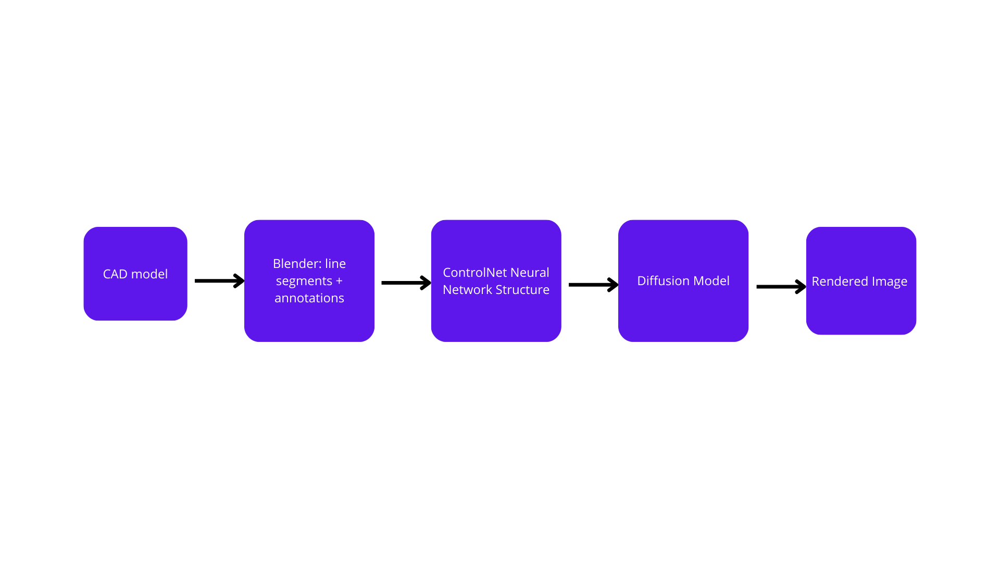

# Introduction

The synthetic data project at VantTec is a continuation of my previous work at Evocortex. It started as a project aimed entirely for rendering synthetic datasets for underwater robotics; however, we are expanding to the other projects, such as the autonomous car (SDV). The next results are generated by conditioning diffusion models:

<figure class="third">
  

  

  
</figure>

# Diffusion Models

Diffusion models offer us the possibility to rendered realistic images for object detection and image segmentation models. However, there are specific objects that are not defined on the usual vocabulary, so the diffusion model requires it to be fine tuned. Here's where LoRA comes to play.

## Contribution
At least for the underwater application, diffusion models does not introduce actual coefficients when dealing with rendering the underwater imagery, making it complicated to be useful for training object detectors,

- (Puiblication targeted for IROS 2025): Synthetic data generation for object detection and image segmentation tasks within underwater and hazing environments. _Under the advice of [Dr. Alberto Muñoz](https://scholar.google.com.mx/citations?user=3o9-OssAAAAJ&hl=en)._

## Contribution 2

Synthetic data offers the possibility to generate automatically the annotations. We implemented a pipeline that looks as follows. The only input necessary to start getting synthetic data already annotated is the CAD model.

{: .align-center}